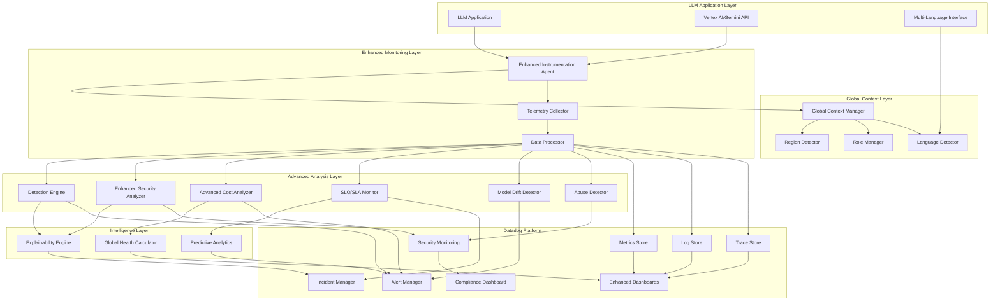

# LLM Observability Monitor Design Document

## Overview

The LLM Observability Monitor is an innovative end-to-end monitoring solution that provides comprehensive observability for Large Language Model applications powered by Google Cloud's Vertex AI or Gemini. The system creates a sophisticated monitoring layer that captures, analyzes, and acts upon telemetry data to ensure optimal performance, security, and cost efficiency of LLM applications.

The solution integrates deeply with both Google Cloud AI services and Datadog's observability platform to provide real-time insights, intelligent alerting, and automated incident management. It addresses the unique challenges of monitoring AI applications, including token usage tracking, model performance analysis, security threat detection, and cost optimization.

## Architecture

The system follows a microservices architecture with global awareness and comprehensive monitoring capabilities:



### Key Architectural Enhancements

1. **Global Context Awareness**: Multi-language and region-aware processing
2. **Advanced Security**: PII detection, auto-redaction, and compliance monitoring
3. **Intelligent Cost Management**: Regional budgets with predictive analytics
4. **Comprehensive SLO Monitoring**: Automated incident management
5. **Model Drift Detection**: Version comparison and behavioral analysis
6. **Explainable AI Operations**: Root cause analysis and remediation guidance
7. **Global Health Scoring**: Unified health metrics across all regions
8. **Abuse Protection**: Rate limiting and threat detection

## Components and Interfaces

### 1. Instrumentation Agent

**Purpose**: Captures telemetry data from LLM applications and Google Cloud AI services with multi-language and region awareness.

**Key Responsibilities**:
- Intercept API calls to Vertex AI/Gemini with language detection
- Capture request/response payloads with region-aware processing
- Measure latency, token usage, and error rates per language/region
- Extract security-relevant information and PII patterns
- Generate structured telemetry events with global context

**Interface**:
```typescript
interface InstrumentationAgent {
  initialize(config: MonitoringConfig): Promise<void>
  captureRequest(request: LLMRequest, context: GlobalContext): TelemetryEvent
  captureResponse(response: LLMResponse, context: GlobalContext): TelemetryEvent
  captureError(error: LLMError, context: GlobalContext): TelemetryEvent
  detectLanguage(text: string): LanguageInfo
  detectRegion(request: LLMRequest): RegionInfo
  shutdown(): Promise<void>
}
```

### 2. Global Context Manager

**Purpose**: Manages multi-language support, region awareness, and user role-based access controls.

**Key Responsibilities**:
- Track user language preferences and regional settings
- Manage data residency compliance requirements
- Enforce role-based access controls (Admin/Developer/End User)
- Handle currency conversion for regional cost tracking
- Coordinate global health score calculations

**Interface**:
```typescript
interface GlobalContextManager {
  setUserLanguage(userId: string, language: SupportedLanguage): void
  setUserRegion(userId: string, region: SupportedRegion): void
  setUserRole(userId: string, role: UserRole): void
  getGlobalContext(userId: string): GlobalContext
  checkComplianceRequirements(region: SupportedRegion, dataType: string): ComplianceCheck
  calculateGlobalHealthScore(): GlobalHealthScore
}
```

### 3. Enhanced Security Analyzer

**Purpose**: Advanced security analysis with PII detection, auto-redaction, and compliance monitoring.

**Key Responsibilities**:
- Detect emails, phone numbers, credit cards, and other PII patterns
- Automatically redact sensitive information from prompts and responses
- Generate compliance alerts based on regional requirements (GDPR, etc.)
- Maintain detailed audit trails for regulatory reporting
- Analyze abuse patterns and implement rate limiting

**Interface**:
```typescript
interface EnhancedSecurityAnalyzer {
  detectPII(text: string): PIIDetectionResult
  redactSensitiveData(text: string, redactionLevel: RedactionLevel): string
  checkComplianceViolations(data: any, region: SupportedRegion): ComplianceViolation[]
  detectAbuse(userId: string, requestPattern: RequestPattern): AbuseAssessment
  generateSecurityIncident(violation: SecurityViolation): DatadogIncident
  maintainAuditTrail(event: SecurityEvent): void
}
```

### 4. Advanced Cost Analyzer

**Purpose**: Sophisticated cost tracking with regional budgets, real-time monitoring, and predictive analytics.

**Key Responsibilities**:
- Track costs per region with currency conversion
- Monitor real-time spending against regional budgets
- Generate cost spike alerts with regional context
- Provide predictive cost modeling and optimization recommendations
- Calculate cost efficiency metrics across regions

**Interface**:
```typescript
interface AdvancedCostAnalyzer {
  trackRegionalCosts(usage: UsageMetrics, region: SupportedRegion): RegionalCostBreakdown
  monitorBudgets(budgets: RegionalBudget[]): BudgetStatus[]
  detectCostSpikes(costData: CostTimeSeries): CostSpikeAlert[]
  predictCosts(usage: UsageMetrics[], timeHorizon: number): CostPrediction
  generateOptimizationRecommendations(costData: CostAnalysis): Optimization[]
  convertCurrency(amount: number, fromCurrency: string, toCurrency: string): number
}
```

### 5. SLO/SLA Monitor

**Purpose**: Comprehensive service level monitoring with automatic incident management.

**Key Responsibilities**:
- Define and track SLOs (latency, error rate, availability)
- Calculate error budgets and burn rates
- Automatically create Datadog incidents on SLO breaches
- Provide SLA compliance reporting and trend analysis
- Generate predictive alerts before SLO violations

**Interface**:
```typescript
interface SLOMonitor {
  defineSLO(slo: ServiceLevelObjective): void
  trackSLOCompliance(metrics: PerformanceMetrics): SLOStatus
  calculateErrorBudget(slo: ServiceLevelObjective, timeWindow: TimeWindow): ErrorBudget
  createSLOIncident(breach: SLOBreach): DatadogIncident
  generateSLOReport(timeRange: TimeRange): SLOReport
  predictSLOViolation(trends: MetricTrends): SLOPrediction[]
}
```

### 6. Model Drift Detector

**Purpose**: Monitors model version changes and detects behavioral drift.

**Key Responsibilities**:
- Automatically detect model version updates
- Compare response quality, latency, and behavior across versions
- Generate drift alerts with impact assessment
- Maintain version-specific performance baselines
- Provide rollback recommendations

**Interface**:
```typescript
interface ModelDriftDetector {
  detectVersionChange(modelInfo: ModelInfo): VersionChangeEvent
  compareModelVersions(oldVersion: string, newVersion: string): DriftAnalysis
  analyzeResponseQuality(responses: ModelResponse[]): QualityMetrics
  generateDriftAlert(drift: DriftAnalysis): DatadogAlert
  recommendActions(drift: DriftAnalysis): DriftRecommendation[]
}
```

### 7. Explainability Engine

**Purpose**: Provides detailed explanations for alerts and suggested remediation actions.

**Key Responsibilities**:
- Explain why alerts were triggered with specific rule details
- Show contributing metrics and threshold breaches
- Provide step-by-step remediation guidance
- Display historical context and similar incidents
- Generate root cause analysis reports

**Interface**:
```typescript
interface ExplainabilityEngine {
  explainAlert(alert: Alert): AlertExplanation
  identifyContributingFactors(alert: Alert): ContributingFactor[]
  generateRemediationSteps(alert: Alert): RemediationStep[]
  findSimilarIncidents(alert: Alert): SimilarIncident[]
  performRootCauseAnalysis(incident: Incident): RootCauseAnalysis
}
```

### 8. Global Health Score Calculator

**Purpose**: Calculates and maintains the unified AI health score across all regions.

**Key Responsibilities**:
- Combine latency, cost, safety, and error metrics into unified score
- Calculate regional health scores with problem area identification
- Track health score trends over time
- Generate health-based alerts and recommendations
- Provide drill-down capabilities for score components

**Interface**:
```typescript
interface GlobalHealthScoreCalculator {
  calculateGlobalScore(metrics: GlobalMetrics): GlobalHealthScore
  calculateRegionalScores(regionalMetrics: RegionalMetrics[]): RegionalHealthScore[]
  trackHealthTrends(scores: HealthScoreTimeSeries): HealthTrend
  identifyHealthIssues(score: GlobalHealthScore): HealthIssue[]
  generateHealthReport(timeRange: TimeRange): HealthReport
}
```

### 2. Telemetry Collector

**Purpose**: Aggregates and buffers telemetry data before streaming to Datadog.

**Key Responsibilities**:
- Batch telemetry events for efficient transmission
- Handle backpressure and retry logic
- Enrich events with metadata (environment, version, etc.)
- Route different event types to appropriate Datadog endpoints

**Interface**:
```typescript
interface TelemetryCollector {
  collect(event: TelemetryEvent): void
  flush(): Promise<void>
  getMetrics(): CollectorMetrics
}
```

### 3. Data Processor

**Purpose**: Transforms raw telemetry into structured metrics, logs, and traces.

**Key Responsibilities**:
- Parse and normalize telemetry events
- Calculate derived metrics (success rates, percentiles)
- Generate distributed traces for request flows
- Prepare data for analysis engines

**Interface**:
```typescript
interface DataProcessor {
  processEvent(event: TelemetryEvent): ProcessedData
  generateMetrics(events: TelemetryEvent[]): Metric[]
  createTrace(events: TelemetryEvent[]): Trace
}
```

### 4. Detection Engine

**Purpose**: Implements intelligent detection rules for performance and operational anomalies.

**Key Responsibilities**:
- Monitor performance thresholds (latency, throughput, errors)
- Detect anomalous patterns using statistical analysis
- Trigger alerts based on configurable rules
- Maintain detection rule state and history

**Interface**:
```typescript
interface DetectionEngine {
  addRule(rule: DetectionRule): void
  evaluateRules(data: ProcessedData): Alert[]
  updateRule(ruleId: string, rule: DetectionRule): void
  removeRule(ruleId: string): void
}
```

### 5. Security Analyzer

**Purpose**: Analyzes LLM interactions for security threats and compliance violations.

**Key Responsibilities**:
- Detect prompt injection attempts
- Identify potentially harmful outputs
- Scan for sensitive data exposure
- Generate security alerts and audit trails

**Interface**:
```typescript
interface SecurityAnalyzer {
  analyzeInput(input: string): SecurityAssessment
  analyzeOutput(output: string): SecurityAssessment
  detectPromptInjection(prompt: string): InjectionRisk
  scanForSensitiveData(text: string): SensitivityReport
}
```

### 6. Cost Analyzer

**Purpose**: Tracks and analyzes LLM usage costs for optimization insights.

**Key Responsibilities**:
- Calculate real-time cost metrics
- Track usage patterns and trends
- Identify cost optimization opportunities
- Generate budget alerts and reports

**Interface**:
```typescript
interface CostAnalyzer {
  calculateCost(usage: UsageMetrics): CostBreakdown
  trackBudget(budget: Budget): BudgetStatus
  identifyOptimizations(usage: UsageMetrics[]): Optimization[]
  generateReport(timeRange: TimeRange): CostReport
}
```

## Data Models

### Core Data Structures

```typescript
// Enhanced telemetry event with global context
interface TelemetryEvent {
  id: string
  timestamp: Date
  type: 'request' | 'response' | 'error' | 'metric'
  source: 'vertex-ai' | 'gemini' | 'application'
  
  // Global context
  globalContext: {
    language: SupportedLanguage
    region: SupportedRegion
    userRole: UserRole
    complianceRequirements: string[]
    currency: string
  }
  
  // Request/Response data
  request?: {
    model: string
    prompt: string
    originalPrompt?: string // before PII redaction
    parameters: Record<string, any>
    userId?: string
    sessionId?: string
    detectedLanguage?: LanguageInfo
    piiDetected?: PIIDetectionResult
  }
  
  response?: {
    content: string
    redactedContent?: string // after PII redaction
    tokenUsage: TokenUsage
    latency: number
    cost: number
    regionalCost?: RegionalCostBreakdown
    qualityScore?: number
  }
  
  error?: {
    code: string
    message: string
    stack?: string
    category: 'performance' | 'security' | 'compliance' | 'cost'
  }
  
  // Enhanced metadata
  metadata: {
    environment: string
    version: string
    service: string
    traceId: string
    spanId: string
    modelVersion?: string
    healthScore?: number
    complianceStatus?: ComplianceStatus
  }
}

// Multi-language support
interface LanguageInfo {
  detected: SupportedLanguage
  confidence: number
  translationRequired: boolean
  culturalContext?: string[]
}

type SupportedLanguage = 'en' | 'hi' | 'es' | 'fr'
type SupportedRegion = 'US' | 'EU' | 'India' | 'APAC'
type UserRole = 'admin' | 'developer' | 'end_user'

// Enhanced security structures
interface PIIDetectionResult {
  found: boolean
  types: PIIType[]
  locations: PIILocation[]
  redactionRequired: boolean
  complianceImpact: ComplianceImpact[]
}

interface PIIType {
  type: 'email' | 'phone' | 'credit_card' | 'ssn' | 'custom'
  pattern: string
  confidence: number
  severity: 'low' | 'medium' | 'high' | 'critical'
}

interface ComplianceViolation {
  type: 'gdpr' | 'data_localization' | 'pii_exposure' | 'cross_border_transfer'
  severity: 'low' | 'medium' | 'high' | 'critical'
  region: SupportedRegion
  description: string
  requiredActions: string[]
  auditTrailId: string
}

// Regional cost tracking
interface RegionalCostBreakdown {
  region: SupportedRegion
  currency: string
  totalCost: number
  costByModel: Record<string, number>
  costByFeature: Record<string, number>
  budgetUtilization: number
  projectedMonthlyCost: number
  costEfficiencyScore: number
}

// SLO/SLA structures
interface ServiceLevelObjective {
  id: string
  name: string
  type: 'latency' | 'error_rate' | 'availability'
  target: number // e.g., 99.9 for 99.9%
  timeWindow: string // e.g., '30d', '7d', '1h'
  region?: SupportedRegion
  alertThreshold: number // e.g., 95 for alert at 95% of target
}

interface SLOStatus {
  slo: ServiceLevelObjective
  currentValue: number
  compliance: number // percentage
  errorBudget: ErrorBudget
  trend: 'improving' | 'stable' | 'degrading'
  riskLevel: 'low' | 'medium' | 'high' | 'critical'
}

interface ErrorBudget {
  total: number
  consumed: number
  remaining: number
  burnRate: number
  timeToExhaustion?: number
}

// Global health score
interface GlobalHealthScore {
  overall: number // 0-100
  components: {
    latency: number
    cost: number
    safety: number
    errors: number
  }
  regional: RegionalHealthScore[]
  trend: HealthTrend
  issues: HealthIssue[]
}

interface RegionalHealthScore {
  region: SupportedRegion
  score: number
  issues: string[]
  trend: 'improving' | 'stable' | 'degrading'
}

// Model drift detection
interface DriftAnalysis {
  oldVersion: string
  newVersion: string
  driftScore: number // 0-100, higher = more drift
  categories: {
    responseQuality: DriftMetric
    latency: DriftMetric
    tokenUsage: DriftMetric
    errorRate: DriftMetric
  }
  significance: 'low' | 'medium' | 'high' | 'critical'
  recommendation: 'continue' | 'monitor' | 'investigate' | 'rollback'
}

interface DriftMetric {
  oldValue: number
  newValue: number
  percentageChange: number
  significance: number
  trend: 'improving' | 'stable' | 'degrading'
}

// Abuse detection
interface AbuseAssessment {
  userId: string
  riskLevel: 'low' | 'medium' | 'high' | 'critical'
  patterns: AbusePattern[]
  recommendedActions: AbuseAction[]
  confidence: number
}

interface AbusePattern {
  type: 'rapid_requests' | 'token_abuse' | 'cost_attack' | 'prompt_injection'
  frequency: number
  timeWindow: string
  severity: number
}

// Explainability structures
interface AlertExplanation {
  alertId: string
  triggerReason: string
  ruleMatched: DetectionRule
  contributingMetrics: ContributingFactor[]
  historicalContext: HistoricalContext
  remediationSteps: RemediationStep[]
  similarIncidents: SimilarIncident[]
}

interface ContributingFactor {
  metric: string
  currentValue: number
  threshold: number
  impact: 'primary' | 'secondary' | 'tertiary'
  trend: MetricTrend
}

interface RemediationStep {
  step: number
  action: string
  priority: 'immediate' | 'high' | 'medium' | 'low'
  estimatedTime: string
  requiredRole: UserRole[]
  automatable: boolean
}
```

### Datadog Integration Models

```typescript
// Datadog metric structure
interface DatadogMetric {
  metric: string
  points: [number, number][] // [timestamp, value]
  tags: string[]
  type: 'gauge' | 'count' | 'rate'
}

// Datadog log structure
interface DatadogLog {
  timestamp: Date
  level: string
  message: string
  service: string
  tags: Record<string, string>
  attributes: Record<string, any>
}

// Datadog trace structure
interface DatadogTrace {
  traceId: string
  spans: DatadogSpan[]
}

interface DatadogSpan {
  spanId: string
  parentId?: string
  operationName: string
  serviceName: string
  startTime: number
  duration: number
  tags: Record<string, string>
  logs?: SpanLog[]
}
```

## Correctness Properties

*A property is a characteristic or behavior that should hold true across all valid executions of a system-essentially, a formal statement about what the system should do. Properties serve as the bridge between human-readable specifications and machine-verifiable correctness guarantees.*

Based on the prework analysis, I'll consolidate related properties to eliminate redundancy:

**Property Reflection:**
- Properties 1.1 and 1.5 both test metric capture - can be combined into comprehensive metric capture property
- Properties 3.1, 3.2, 3.3, 3.4, 3.5 all test detection rules - can be combined into general detection rule property
- Properties 4.1, 4.2, 4.3 all test incident creation - can be combined into comprehensive incident creation property
- Properties 5.1, 5.2, 5.3 all test security scanning - can be combined into comprehensive security analysis property
- Properties 6.1, 6.3, 6.4, 6.5 all test cost analysis - can be combined into comprehensive cost tracking property

**Property 1: Comprehensive Metric Capture**
*For any* LLM request processed by the system, all required metrics (response times, token counts, performance metrics, request volume, success rates, error patterns) should be captured and made available
**Validates: Requirements 1.1, 1.5**

**Property 2: Telemetry Streaming Performance**
*For any* telemetry data collected, it should be streamed to Datadog within 5 seconds of generation
**Validates: Requirements 1.2**

**Property 3: Universal Detection Rule Triggering**
*For any* performance metric, security threat, or anomaly that exceeds defined thresholds, the appropriate detection rules should trigger automatically
**Validates: Requirements 1.3, 3.1, 3.2, 3.3, 3.4, 3.5**

**Property 4: Dashboard Auto-Refresh**
*For any* dashboard data request, visualizations should refresh automatically every 30 seconds
**Validates: Requirements 2.4**

**Property 5: Security Event Visibility**
*For any* security event that occurs, it should be surfaced prominently on the dashboard
**Validates: Requirements 2.3**

**Property 6: Comprehensive Incident Creation**
*For any* triggered detection rule, an incident should be created in Datadog with detailed context including relevant logs, metrics, traces, model configuration, request samples, and error details
**Validates: Requirements 4.1, 4.2, 4.3**

**Property 7: Incident Routing and Resolution**
*For any* incident created, it should be routed to appropriate team members based on severity, and when resolved, should capture resolution time and root cause information
**Validates: Requirements 4.4, 4.5**

**Property 8: Comprehensive Security Analysis**
*For any* user input or model output processed, the system should scan for prompt injection attempts, harmful content, biased content, and sensitive information
**Validates: Requirements 5.1, 5.2, 5.3**

**Property 9: Security Incident and Audit Management**
*For any* compliance violation detected, a high-priority security incident should be created, and all security pattern analysis should maintain audit trails
**Validates: Requirements 5.4, 5.5**

**Property 10: Comprehensive Cost Tracking**
*For any* API usage, real-time cost metrics should be calculated, optimization opportunities identified, trends analyzed, and detailed breakdowns provided
**Validates: Requirements 6.1, 6.3, 6.4, 6.5**

**Property 11: Budget Alert System**
*For any* cost threshold that is approached, budget alert notifications should be sent
**Validates: Requirements 6.2**

**Property 12: Automatic Instrumentation**
*For any* LLM application deployment, the system should automatically instrument the application with minimal configuration
**Validates: Requirements 7.1**

**Property 13: Model-Adaptive Monitoring**
*For any* LLM model used, the monitoring system should adapt strategies to model-specific characteristics
**Validates: Requirements 7.2**

**Property 14: CI/CD Integration**
*For any* CI/CD pipeline integration, the system should provide deployment health checks and rollback triggers
**Validates: Requirements 7.3**

**Property 15: Development Environment Support**
*For any* development environment usage, the system should support local testing with mock telemetry streams
**Validates: Requirements 7.4**

**Property 16: Scaling Coverage Maintenance**
*For any* application scaling event, monitoring coverage should be maintained across all instances automatically
**Validates: Requirements 7.5**

## Error Handling

The system implements comprehensive error handling across all components:

### 1. Telemetry Collection Errors
- **Network failures**: Implement exponential backoff with jitter for Datadog API calls
- **Rate limiting**: Respect Datadog API limits with intelligent queuing
- **Data validation**: Validate telemetry events before transmission
- **Circuit breaker**: Prevent cascade failures when Datadog is unavailable

### 2. LLM API Errors
- **Authentication failures**: Retry with fresh tokens, alert on persistent failures
- **Quota exceeded**: Track usage against quotas, implement graceful degradation
- **Model unavailability**: Fallback to alternative models when possible
- **Timeout handling**: Configurable timeouts with proper cleanup

### 3. Detection Engine Errors
- **Rule evaluation failures**: Isolate failing rules, continue processing others
- **False positive mitigation**: Implement confidence scoring and validation
- **Alert fatigue prevention**: Intelligent alert grouping and suppression
- **State corruption**: Automatic recovery and state validation

### 4. Security Analysis Errors
- **Analysis timeout**: Set reasonable timeouts for security scans
- **Model failures**: Graceful degradation when security models are unavailable
- **Privacy protection**: Ensure error logs don't expose sensitive data
- **Compliance failures**: Fail-safe approach for compliance violations

## Testing Strategy

The testing approach combines unit testing and property-based testing to ensure comprehensive coverage:

### Unit Testing Approach
Unit tests will focus on:
- Component initialization and configuration
- API integration points with Google Cloud and Datadog
- Error handling and edge cases
- Security analysis accuracy with known test cases
- Cost calculation correctness with sample data
- Dashboard rendering with mock data

### Property-Based Testing Approach
Property-based tests will verify universal properties using **fast-check** (JavaScript/TypeScript property-based testing library). Each property-based test will run a minimum of 100 iterations to ensure statistical confidence.

Key property test areas:
- **Telemetry Processing**: Generate random LLM requests and verify all required metrics are captured
- **Detection Rules**: Generate various threshold breaches and verify appropriate rules trigger
- **Security Analysis**: Generate diverse inputs including injection attempts and verify detection
- **Cost Calculations**: Generate random usage patterns and verify cost accuracy
- **Incident Management**: Generate various alert conditions and verify proper incident creation
- **Data Streaming**: Generate telemetry events and verify timely Datadog delivery

Each property-based test will be tagged with comments explicitly referencing the correctness property from this design document using the format: **Feature: llm-observability-monitor, Property {number}: {property_text}**

### Integration Testing
- End-to-end workflows with real Google Cloud and Datadog APIs
- Performance testing under high LLM request volumes
- Failure scenario testing (network partitions, API outages)
- Security testing with real attack patterns

### Monitoring Test Coverage
- Verify all detection rules trigger correctly
- Validate dashboard accuracy against known data
- Test incident escalation workflows
- Verify audit trail completeness

## Implementation Technologies

### Core Technologies
- **Runtime**: Node.js with TypeScript for type safety and performance
- **Google Cloud Integration**: Official Google Cloud AI client libraries
- **Datadog Integration**: Datadog API client and StatsD for metrics
- **Security Analysis**: Integration with Google Cloud DLP API and custom ML models
- **Configuration**: Environment-based configuration with validation

### Key Libraries
- **@google-cloud/aiplatform**: Vertex AI integration
- **@google-cloud/dlp**: Data Loss Prevention for sensitive data detection
- **datadog-api-client**: Official Datadog API client
- **hot-shots**: StatsD client for metrics
- **fast-check**: Property-based testing framework
- **jest**: Unit testing framework
- **winston**: Structured logging
- **joi**: Configuration validation

### Deployment Architecture
- **Containerized**: Docker containers for consistent deployment
- **Kubernetes**: Orchestration with auto-scaling capabilities
- **Monitoring**: Self-monitoring with Datadog integration
- **Security**: Secrets management with Google Secret Manager
- **CI/CD**: GitHub Actions with automated testing and deployment